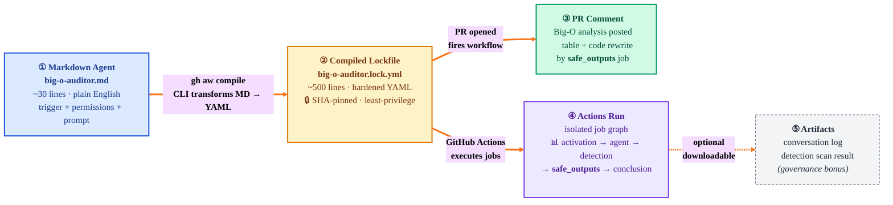
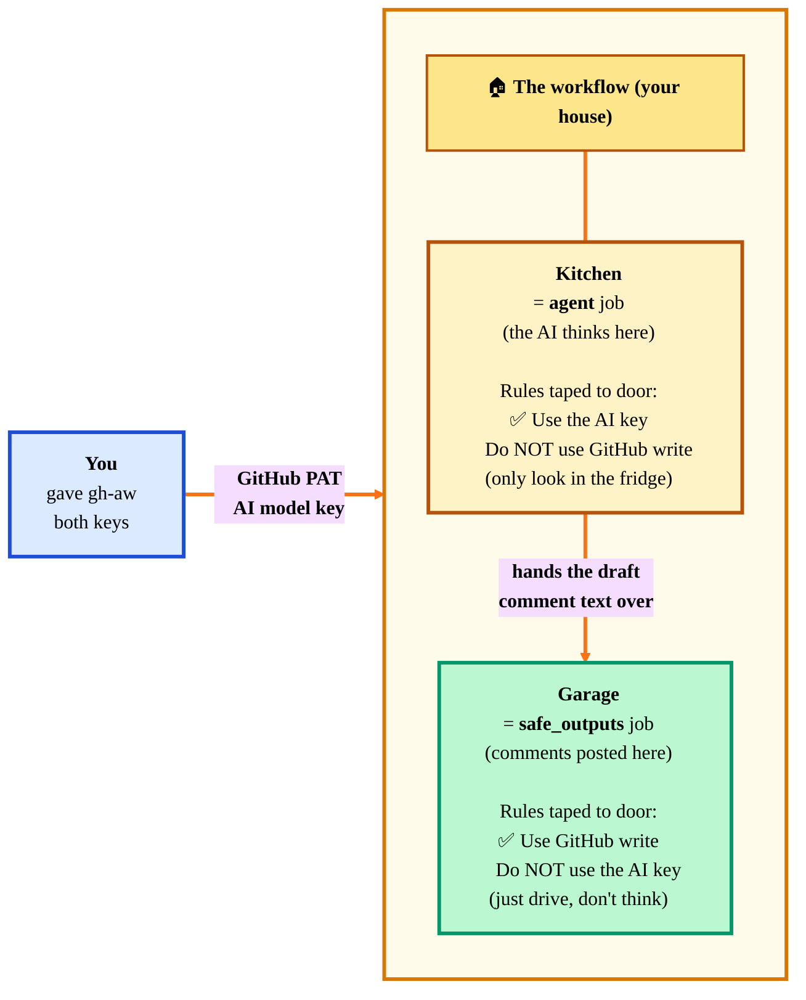
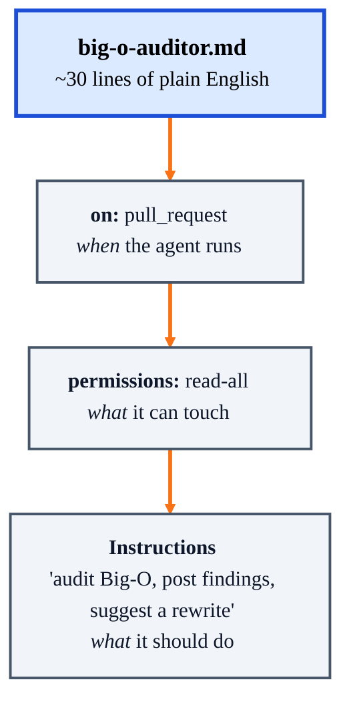
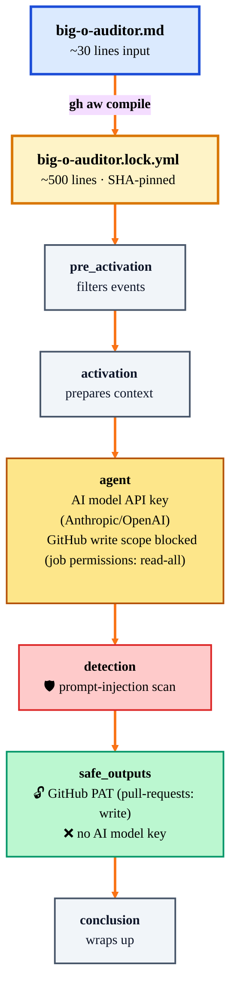
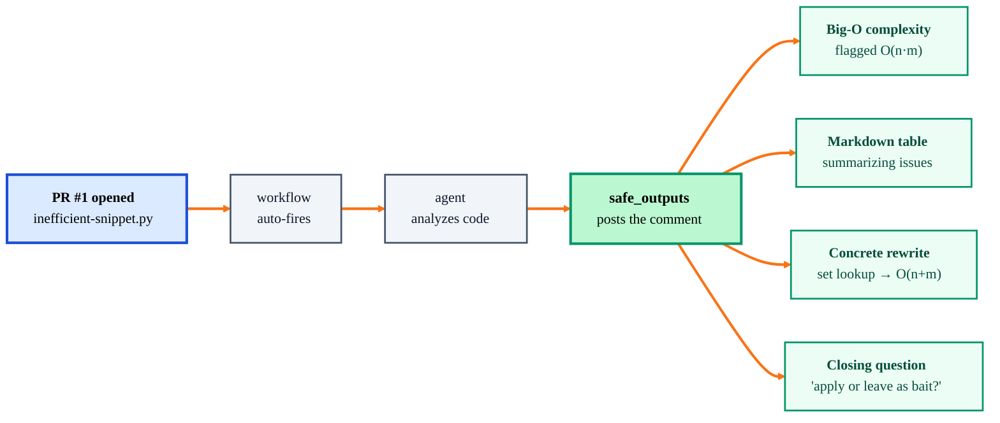
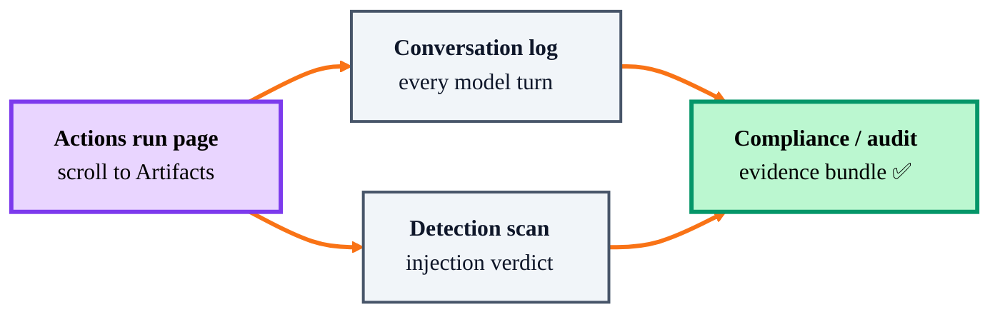

# Beat 1 debrief — what you just saw

## What is this document?

You just finished **Demo 1** from [plan.md](plan.md). This debrief helps you reflect on what happened, replay the evidence at your own pace, and connect each moment to the gh-aw concept it demonstrated. If anything moved too fast during the live demo, this is where you slow it down.

If you're new to gh-aw, here's the 30-second primer you just watched in action:

- **gh-aw** lets you write GitHub Actions workflows as plain-English **markdown agents** instead of hand-written YAML.
- The `gh aw compile` CLI turns that markdown into a **hardened, auditable lockfile** (`.lock.yml`) that GitHub Actions runs.
- The compiled workflow uses **isolated jobs with least-privilege permissions** — the AI job can read code but can't write; only a separate gated job can post comments.

Use this debrief to revisit the 5 tabs you just saw, in the same order, and check your understanding before moving on to Beat 2.

## The flow you just walked through

> **Legend:** 🧠 Input you authored · 🔒 What gh-aw generated for you · 💬 What the audience saw · 📊 The auditable receipt · 📎 Optional governance evidence

---

## The two keys — explained like you're five

If the "no write / no key" labels in the diagrams confused you, read this once and it will click forever.

### Your workflow has **two completely different keys**

| Key | What it really is | What it unlocks |
|---|---|---|
| 🔑 **GitHub PAT** (the one you made with read/write) | A GitHub password | Posting comments, opening issues on your repo |
| 🧠 **AI model key** (Anthropic / OpenAI) | A password for the AI | Talking to Claude/GPT so the workflow can *think* |

These keys are not interchangeable. The GitHub PAT can't talk to Claude. The AI key can't post on GitHub. They do different jobs.

### The house analogy

Imagine your workflow is a **house** with two rooms:

- 🧊 **The kitchen** = the `agent` job (where the AI thinks)
- 🚗 **The garage** = the `safe_outputs` job (where comments get posted)

You (the owner) hand your teenager (the workflow) a full keyring with **both** keys. But you tape a note to each room's door:

### What each rule means in real YAML

| The taped note says… | In the lockfile it looks like… |
|---|---|
| *"Kitchen: don't use GitHub write"* | `permissions: read-all` on the `agent` job |
| *"Garage: can use GitHub write"* | `permissions: { pull-requests: write }` on the `safe_outputs` job |
| *"Kitchen: here's the AI key"* | `env: { ANTHROPIC_API_KEY: ... }` only on the `agent` job |
| *"Garage: no AI key for you"* | `safe_outputs` job has no AI key in its env |

### Why split it this way?

Because if a bad actor opens a PR that **tricks the AI** into doing something nasty (prompt injection), the AI is trapped in the kitchen. It has the AI key, but no GitHub write — so the worst it can do is *read* files. It literally cannot post, merge, or break anything.

The garage can post, but there's no AI in the garage to trick. It just takes the text the kitchen prepared and puts it on GitHub. Dumb, predictable, safe.

**That's the whole security story.** Your PAT has full power — gh-aw just decides which room gets which slice of that power.

### Does this break anything?

No. Your PAT still needs *Pull requests: Read/Write* and *Issues: Read/Write* — exactly what `plan.md` told you to set. Without those, the `safe_outputs` job (the garage) would have nothing to unlock. You gave the full key; the lockfile just limits where it gets used.

---

Everything from Part 3 of [plan.md](plan.md) is now sitting on GitHub as permanent evidence. Revisit these five tabs in the same order you just walked through them — this time at your own pace.

## 1. The source markdown agent (the "input" you started from)

**What you just opened:** `gh-aw-demo/.github/workflows/big-o-auditor.md` in VS Code (or on github.com).

**What you said to the audience:** *"This is the entire agent. Plain English, no YAML pipeline. The trigger (`on: pull_request`), the permissions (`read-all`), and the instructions are all in one ~30-line markdown file."*

**Why it landed:** the audience expected a heavy YAML pipeline and saw a short English file instead. That gap is the whole pitch.

## 2. The compiled lockfile (the "output" of `gh aw compile`)

**What you just opened:** `.github/workflows/big-o-auditor.lock.yml` side-by-side with the `.md`.

**What you said to the audience:** *"Here's the hardened Actions workflow gh-aw generated for me. Notice it's ~500 lines, pins every action to a SHA, splits into `activation / agent / detection / safe_outputs / conclusion` jobs, and only `safe_outputs` has write permission to comment. I didn't write any of this — and I can audit it before it runs."*

**Three things you pointed at:**

- `permissions: read-all` at the top (the agent job itself can't write)
- The `safe_outputs` job where `pull-requests: write` is scoped
- The `detection` job — that's the prompt-injection scanner

> **Two different tokens — don't confuse them:**
>
> - **Your GitHub PAT** (the one you created per `plan.md` with *Pull requests: Read/Write* and *Issues: Read/Write*) — gh-aw stores it as `COPILOT_GITHUB_TOKEN`. It exists in the workflow env, **but each job only gets the GitHub scopes its `permissions:` block declares.** The `agent` job's block is `read-all`, so even with the PAT present, it cannot post. Only the `safe_outputs` job's block opens `pull-requests: write`.
> - **The AI model API key** (Anthropic / OpenAI / whatever LLM backs the agent) — injected only into the `agent` job because that's the only job that calls the LLM. `safe_outputs` never sees it.
>
> That's the split the diagrams highlight: same workflow, two different secrets, each scoped to exactly one job.

**Why it landed:** "least privilege" stopped being a slide and became a line number you can click.

## 3. The PR with the agent's comment (the "proof it worked")

**What you just opened:** <https://github.com/lenvolk/gh-aw-demo/pull/1>

**What the audience saw in the comment:**

- The Big-O complexity analysis flagging O(n·m)
- The markdown table summarizing the issues
- The concrete code rewrite (set lookup → O(n+m))
- The closing question ("want me to apply this or leave it as demo bait?")

**What you said:** *"I didn't press any button. Opening the PR fired the workflow; ~2 min later this comment appeared. Same flow would work on a 500-file monorepo PR."*

**Why it landed:** no button press = automation. A real code rewrite = genuine value, not a toy.

## 4. The Actions run (the "receipt")

```mermaid
%%{init: {"theme": "base", "themeVariables": {"fontSize":"16px","fontFamily":"Segoe UI, Helvetica, Arial, sans-serif","primaryTextColor":"#0F172A","lineColor":"#475569"}}}%%
flowchart LR
    PA["<b>pre_activation</b><br/>filter events"]
    AC["<b>activation</b><br/>setup context"]
    AG["<b>agent</b><br/>🔑 AI model key<br/>🚫 no GitHub write<br/>reasoning logged"]
    DT["<b>detection</b><br/>🛡️ injection scan"]
    SO["<b>safe_outputs</b><br/>🔓 GitHub PAT write<br/>❌ no AI model key"]
    CN["<b>conclusion</b><br/>⏱️ ~90–120 sec total"]

    PA --> AC --> AG --> DT --> SO --> CN

    linkStyle default stroke:#F97316,stroke-width:3px,color:#000,font-weight:bold

    classDef setup fill:#F1F5F9,stroke:#475569,stroke-width:2px,color:#0F172A
    classDef agent fill:#FDE68A,stroke:#B45309,stroke-width:3px,color:#000
    classDef guard fill:#FECACA,stroke:#DC2626,stroke-width:3px,color:#000
    classDef write fill:#BBF7D0,stroke:#059669,stroke-width:3px,color:#000
    classDef done fill:#E9D5FF,stroke:#7C3AED,stroke-width:2px,color:#0F172A
    class PA,AC setup
    class AG agent
    class DT guard
    class SO write
    class CN done
```

**What you just opened:** <https://github.com/lenvolk/gh-aw-demo/actions/workflows/big-o-auditor.lock.yml> → the latest run.

**Three things you showed:**

- **Job graph:** `pre_activation → activation → agent → detection → safe_outputs → conclusion`. Each job is isolated — the `agent` job had the **AI model API key** but the job's `permissions:` block was `read-all`, so it couldn't post. `safe_outputs` had **GitHub write scope** (via your PAT) but no AI model key.
- **Agent logs:** clicking the `agent` job and expanding the prompt step revealed the exact reasoning the model took. Full audit trail for every run.
- **Duration:** total runtime was ~90–120 sec. *"This cost cents, not dollars, and ran in the time it takes to refill your coffee."*

**Why it landed:** security folks in the audience stopped worrying once they saw the key/write-scope split visually in the job graph.

## 5. The artifacts (the governance bonus)

**What you showed (only if someone asked about governance):** on the run page, scrolling to **Artifacts** at the bottom revealed the full conversation log and the detection scan result as downloadable files.

**Why it landed:** this is the answer to *"how do we prove to auditors what the AI did?"* — it's already attached to every run.

## The one-sentence takeaway you left them with

*"I wrote English. GitHub generated hardened YAML. An AI reviewed code. A separate gated job posted the comment. Every step is auditable, and I still control the permissions — this is what 'productive ambiguity with guardrails' looks like."*

## Debrief checklist — before moving on

- [ ] You saw the `.md` file and understood it was the only thing you authored.
- [ ] You spotted that the `.lock.yml` is ~500 lines and SHA-pinned — and you did **not** write it.
- [ ] You identified which job had the API key vs. which job had write permission.
- [ ] You saw a real comment on a real PR, not a screenshot.
- [ ] You know where to click to download the audit artifacts.

If any of those are fuzzy, scroll back up to the matching section and reopen that tab before Beat 2.

## Transition to Beat 2

*"Now watch the same pattern work for a completely different trigger — filing an issue."* → jump to **Part 4** of [plan.md](plan.md) for Beat 2.
