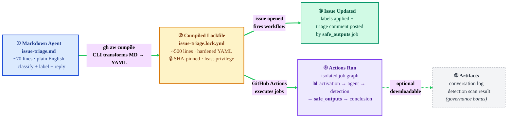
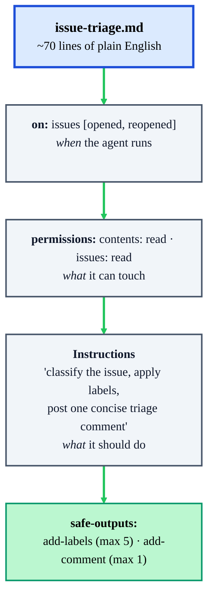
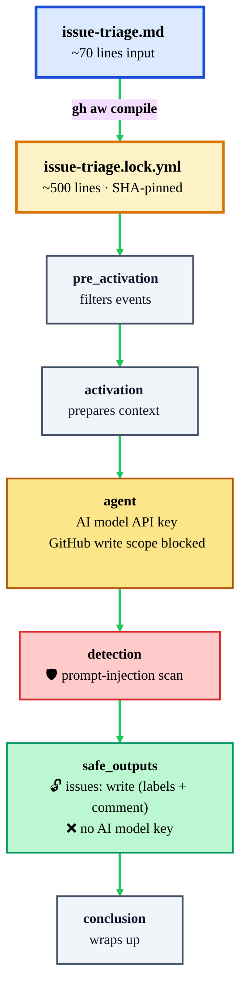
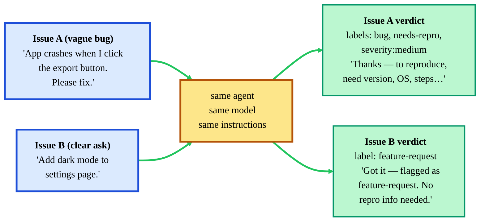
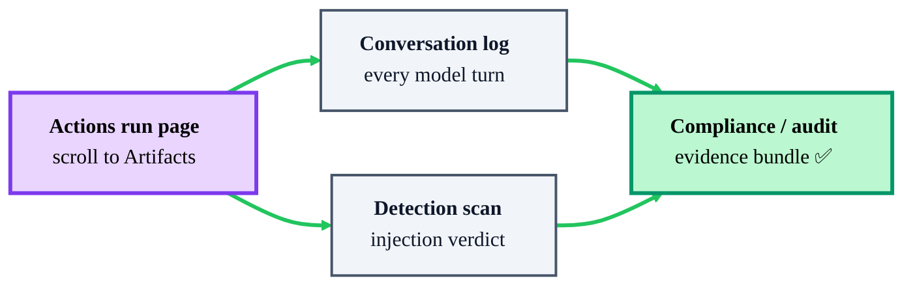

# Beat 2 debrief — what you just saw

## What is this document?

You just finished **Demo 2** from [plan.md](plan.md) — the Issue Triage agent. This debrief lets you slow down and reconnect each moment to the gh-aw concept it demonstrated. If Beat 2 flew by during the live demo, walk through the 5 tabs again at your own pace.

Beat 1 already covered the big ideas (markdown → `.lock.yml`, the two-key split, the 5-job graph). **Beat 2's job is contrast**: same building block, a different trigger, a different safe-output type. If the `.md → .lock.yml` pattern felt like a one-trick pony in Beat 1, Beat 2 is the proof it isn't.

> New to the project? Read [Beat_1_debrief.md](Beat_1_debrief.md) first — the "two keys / kitchen + garage" analogy there applies unchanged to Beat 2.

## The flow you just walked through

> Editable source: [assets/beat-2-flow.excalidraw](assets/beat-2-flow.excalidraw) — open with the [Excalidraw VS Code extension](https://marketplace.visualstudio.com/items?itemName=pomdtr.excalidraw-editor) or at <https://excalidraw.com>.

> **Legend:** 🧠 Input you authored · 🔒 What gh-aw generated for you · 💬 What the audience saw · 📊 The auditable receipt · 📎 Optional governance evidence

---

## What changed vs. Beat 1 — the one-minute version

Everything about the pipeline (compile step, 5-job graph, two-key split, detection scan) is **identical** to Beat 1. Only three things in the `.md` are different:

| Aspect | Beat 1 (Big-O Auditor) | Beat 2 (Issue Triage) |
|---|---|---|
| Trigger | `on: pull_request` | `on: issues: [opened, reopened]` |
| Safe outputs | `add-comment` | `add-labels` + `add-comment` |
| Garage's GitHub scope | `pull-requests: write` | `issues: write` |

That's it. The audience just saw *"swap three lines of English, get a completely different automation — on the same rails."* If you want the full pattern write-up, it lives in [Beat_1_debrief.md](Beat_1_debrief.md#the-two-keys--explained-like-youre-five).

---

## 1. The source markdown agent (the "input" you started from)

**What you just opened:** `gh-aw-demo/.github/workflows/issue-triage.md` in VS Code (or on github.com).

**What you said to the audience:** *"This is the entire triage bot. Same ~30-line-ish markdown structure as Beat 1. The trigger changed from `pull_request` to `issues`, and I added `add-labels` to safe-outputs. That's it — no new tooling, no new concepts."*

**Why it landed:** the audience already bought the markdown-agent story in Beat 1. This is the moment they realize it generalizes.

## 2. The compiled lockfile (the "output" of `gh aw compile`)

**What you just opened:** `.github/workflows/issue-triage.lock.yml` next to the `.md`.

**What you said to the audience:** *"Same 5-job graph as Beat 1. Same detection job. Same least-privilege split. The only difference in the lockfile is that `safe_outputs` now has `issues: write` instead of `pull-requests: write` — because this agent's outputs target issues, not PRs."*

**One thing to point at:** on the `safe_outputs` job, the `permissions:` block. It lists exactly the scopes your safe-outputs declared — nothing more. If you hadn't written `add-labels`, the lockfile wouldn't ask for label write.

**Why it landed:** it reinforces the "you declared it, the compiler provisioned it, and no wider" message. Nothing sneaks in.

## 3. The issues (the "proof it worked")

You actually filed **two** issues on purpose — that contrast is where Beat 2 earns its keep.

**What the audience saw:**

- **Issue A** ("App crashes when I click the export button. Please fix."): labelled `bug` + `needs-repro` + a severity, and the triage comment asked — as a checklist — for version, OS, exact steps, and the error message.
- **Issue B** ("Add dark mode to settings page"): labelled `feature-request` only, and the triage comment acknowledged the ask without begging for repro steps (because it's not a bug).

**What you said:** *"Same agent, same model, same instructions. Two issues, two genuinely different responses. The model read the content and routed."*

**Why it landed:** one of the loudest objections to "AI automation" is *"it'll just blast the same canned reply at everything"*. Beat 2 refutes that live.

### ⚠️ Common question: "Did the agent write the code for dark mode?"

**No — the agent only classified and commented.** Look at the issue's **Conversation** tab: a label set and a single comment. There are no new commits, no new PRs. This agent's `safe-outputs` block only lists `add-labels` and `add-comment`; there is no `create-pull-request` or `contents: write` anywhere in the compiled lockfile. The garage has keys to the mailbox and the label-maker — that's it.

The agent that *does* write code is Beat 3.

## 4. The Actions run (the "receipt")

```mermaid
%%{init: {"theme": "base", "themeVariables": {"fontSize":"16px","fontFamily":"Segoe UI, Helvetica, Arial, sans-serif","primaryTextColor":"#0F172A","lineColor":"#475569"}}}%%
flowchart LR
    PA["<b>pre_activation</b><br/>filter events"]
    AC["<b>activation</b><br/>setup context"]
    AG["<b>agent</b><br/>🔑 AI model key<br/>🚫 no GitHub write<br/>reasoning logged"]
    DT["<b>detection</b><br/>🛡️ injection scan"]
    SO["<b>safe_outputs</b><br/>🔓 issues: write<br/>❌ no AI model key"]
    CN["<b>conclusion</b><br/>⏱️ ~90–120 sec total"]

    PA --> AC --> AG --> DT --> SO --> CN

    linkStyle default stroke:#22C55E,stroke-width:3px,color:#000,font-weight:bold

    classDef setup fill:#F1F5F9,stroke:#475569,stroke-width:2px,color:#0F172A
    classDef agent fill:#FDE68A,stroke:#B45309,stroke-width:3px,color:#000
    classDef guard fill:#FECACA,stroke:#DC2626,stroke-width:3px,color:#000
    classDef write fill:#BBF7D0,stroke:#059669,stroke-width:3px,color:#000
    classDef done fill:#E9D5FF,stroke:#7C3AED,stroke-width:2px,color:#0F172A
    class PA,AC setup
    class AG agent
    class DT guard
    class SO write
    class CN done
```

**What you just opened:** the Issue Triage workflow run under the **Actions** tab.

**Three things you showed:**

- **Same job graph** as Beat 1 — visually identical in the Actions UI. Different filename at the top; same shape underneath.
- **Agent logs** — the reasoning step shows the model's classification logic (why it picked `bug` + `needs-repro`, why it didn't add `severity:critical`). A real audit trail for a triage decision.
- **Duration** — the run is typically shorter than Beat 1 because there's no code diff to analyze, just issue text.

**Why it landed:** engineering leaders stop asking *"can we explain its decisions?"* once they see the reasoning step.

## 5. The artifacts (the governance bonus)

Same as Beat 1 — every run drops the conversation log and detection scan as downloadable artifacts. **This is the setup for the Part 6 coda:** the detection artifact is what you'll open when you file the poisoned issue and show that `safe_outputs` got skipped.

## The one-sentence takeaway you left them with

*"Same markdown building block, new trigger, new safe-outputs — and suddenly the bot triages issues instead of reviewing PRs. I changed three lines; gh-aw handled the other 500."*

## Debrief checklist — before moving on

- [ ] You saw `issue-triage.md` and recognized the structure from Beat 1 — trigger, permissions, instructions, safe-outputs.
- [ ] You spotted that only the trigger (`on: issues`) and safe-outputs (`add-labels` + `add-comment`) differ from Beat 1.
- [ ] You filed both a vague bug and a clear feature request, and saw the agent route them differently.
- [ ] You confirmed the agent added **zero commits and zero PRs** — only labels and a comment.
- [ ] You clicked through the Actions run and found the same 5-job graph as Beat 1.

If any of those are fuzzy, scroll back and reopen the matching tab before deciding what to do next.

## Transition — two ways forward

**Most audiences stop here** and you move to the **Part 6 security coda** (the poisoned-issue demo that reuses this very workflow). It's short, dramatic, and closes the deck.

**If your audience is already nodding along**, jump to **Beat 3** — same pattern, one more twist: the agent writes actual code and opens a pull request with it. Walk-through lives in **Part 5** of [plan.md](plan.md); debrief in [Beat_3_debrief.md](Beat_3_debrief.md).
