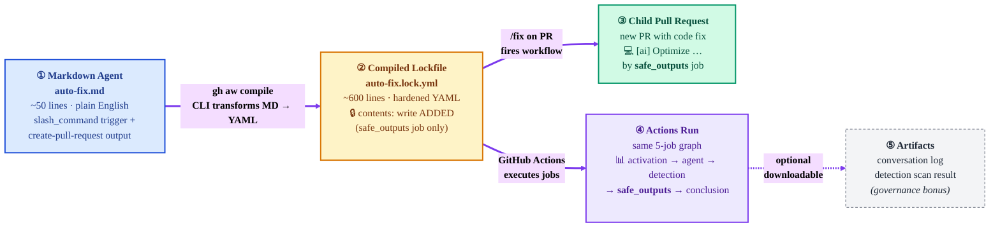
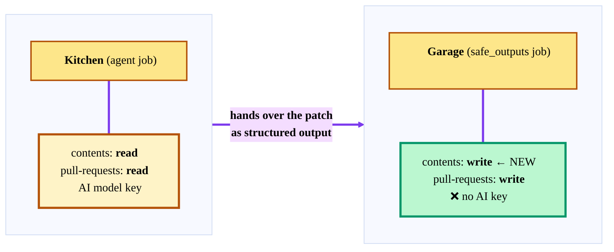
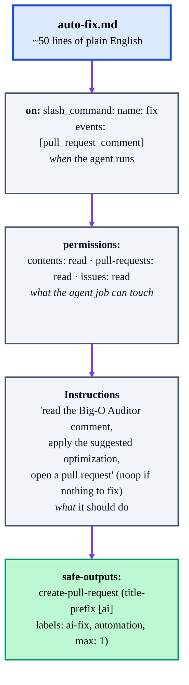
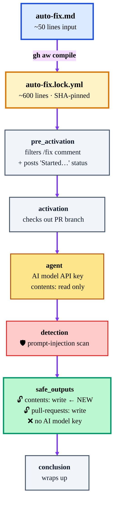
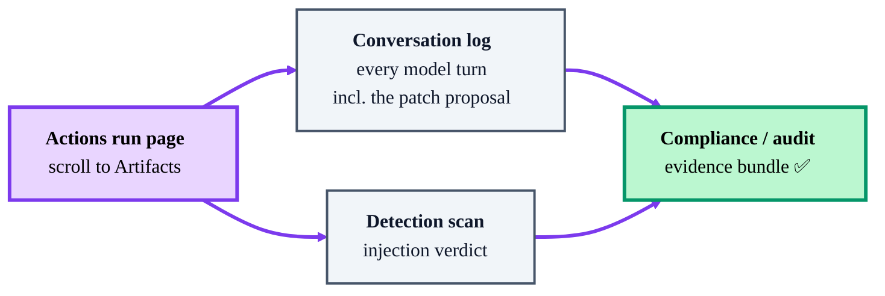

# Beat 3 debrief — what you just saw

## What is this document?

You just finished the **advanced Demo 3** from [plan.md](plan.md) — the Auto-Fix agent triggered by a `/fix` slash command. This is the "wow" beat: the same markdown pattern you've seen twice now produces an agent that **writes code and opens a pull request**, not just a comment or a label.

If the Actions run flashed by on stage, walk through the 5 tabs here at your own pace.

> Prereqs for this debrief to fully land:
>
> - You've already read [Beat_1_debrief.md](Beat_1_debrief.md) (the two-key / kitchen + garage model).
> - You've seen [Beat_2_debrief.md](Beat_2_debrief.md) (same building block, different trigger/outputs).
>
> Beat 3 adds **one new power to the garage** and changes the trigger for the third time. Everything else is the same pattern.

## The flow you just walked through


> Editable source: [assets/beat-3-flow.excalidraw](assets/beat-3-flow.excalidraw) — open with the [Excalidraw VS Code extension](https://marketplace.visualstudio.com/items?itemName=pomdtr.excalidraw-editor) or at <https://excalidraw.com>.



> **Legend:** 🧠 Input you authored · 🔒 What gh-aw generated for you · 💻 Actual code, not prose · 📊 The auditable receipt · 📎 Optional governance evidence

---

## The one new idea in Beat 3 — "a new key appears on the garage door"

Go back to the house analogy from [Beat_1_debrief.md](Beat_1_debrief.md#the-two-keys--explained-like-youre-five). In Beats 1 & 2, the garage (the `safe_outputs` job) could post comments and set labels. That's the **mailbox** and the **label-maker**.

In Beat 3, when you wrote `safe-outputs: create-pull-request:` in the `.md`, the compiler taped one additional note on the garage door:

> ✅ *"This garage can also push a new branch and open a pull request"*

Which became this in the lockfile:

```yaml
# only on the safe_outputs job:
permissions:
  contents: write        # ← NEW in Beat 3 — push branches
  pull-requests: write   # open the PR
```

**What stayed the same:**

- The **kitchen** (`agent` job) is still `contents: read`. The AI still cannot push code. It *plans* the change and hands the patch to the garage as structured output.
- There's still **no AI key** in the garage — it just takes the patch the kitchen prepared and runs `git push` + `gh pr create`.
- Detection still runs between kitchen and garage. A poisoned comment can't skip the scan.

**Why this matters:** going from "AI that comments" to "AI that contributes code" sounds like a huge security leap — and in a hand-rolled YAML pipeline, it would be. In gh-aw it's **one declarative line** that the compiler translates into exactly one extra scope on exactly one job.



---

## 1. The source markdown agent (the "input" you started from)



**What you just opened:** `gh-aw-demo/.github/workflows/auto-fix.md` in VS Code (or on github.com).

**What you said to the audience:** *"This file is still ~50 lines of English. The trigger is a slash command on PR comments. The output is `create-pull-request`. I did not write any Git plumbing, any branch-naming logic, any PAT handling — the compiler does all of that."*

**Three things you pointed at:**

- `on: slash_command: name: fix` — the new trigger. Same pattern as `pull_request` and `issues`, just a different keyword.
- `events: [pull_request_comment]` — critical subtlety. gh-aw maps both `issue_comment` and `pull_request_comment` onto GitHub's single `issue_comment` event; this flag restricts the workflow to **PR comments**. Using `issue_comment` here would make the workflow ignore PR comments entirely.
- `safe-outputs: create-pull-request:` — the new output type. The compiler sees this and provisions the extra `contents: write` scope on the garage.

**Why it landed:** the audience just watched "trigger changed → new agent, same rails" twice. Seeing it work a *third* time (with the biggest capability jump yet) locks in the pattern.

## 2. The compiled lockfile (the "output" of `gh aw compile`)



**What you just opened:** `.github/workflows/auto-fix.lock.yml` side-by-side with `big-o-auditor.lock.yml` from Beat 1.

**What you said to the audience:** *"Diff these two lockfiles. They're almost identical. The only material difference is on the `safe_outputs` job: Beat 3 has `contents: write` added, because that's the only job that needs to push a branch. The `agent` job is still read-only — the AI cannot push code even though it's the one reasoning about the fix."*

**Two things you pointed at:**

- The `agent` job's `permissions:` block — still `contents: read` / `pull-requests: read` / `issues: read`. No write power even with the new output type.
- The `safe_outputs` job's `permissions:` block — `contents: write` + `pull-requests: write`. This is the only job in the entire workflow that can modify the repo.

**Why it landed:** for a security-skeptical audience, this is the moment. "AI writes code" and "AI has write access" are decoupled. The AI never has both.

> **One-time repo setting (the gotcha):** Beat 3 also needs **Settings → Actions → General → Workflow permissions → "Allow GitHub Actions to create and approve pull requests"** enabled. Without it the run still reports success but the PR creation is blocked by GitHub itself — the agent falls back to filing an issue with the diff. If you saw that on stage, that's the cause.

## 3. The pull requests (the "proof it worked")

Beat 3 produces **two** PR pages worth showing: the triggering PR (where you typed `/fix`) and the child PR the agent opened.

```mermaid
%%{init: {"theme": "base", "themeVariables": {"fontSize":"16px","fontFamily":"Segoe UI, Helvetica, Arial, sans-serif","primaryTextColor":"#0F172A","lineColor":"#475569"}}}%%
flowchart LR
    PR1["<b>PR #1 (Beat 1)</b><br/>slow code +<br/>auditor comment"]
    FIX["human posts<br/><b>/fix</b>"]
    STATUS["<b>pre_activation</b><br/>auto-posts 'Started…'<br/>status comment"]
    AGENT["<b>agent</b><br/>reads audit,<br/>drafts patch"]
    POST["<b>safe_outputs</b><br/>pushes branch +<br/>opens child PR"]
    PR2["<b>Child PR (Beat 3)</b><br/>[ai] Optimize …<br/>labels: ai-fix, automation<br/>diff = just the fix"]

    PR1 --> FIX --> STATUS --> AGENT --> POST --> PR2

    linkStyle default stroke:#7C3AED,stroke-width:3px,color:#000,font-weight:bold

    classDef pr fill:#DBEAFE,stroke:#1D4ED8,stroke-width:3px,color:#000
    classDef step fill:#F1F5F9,stroke:#475569,stroke-width:2px,color:#0F172A
    classDef action fill:#FDE68A,stroke:#B45309,stroke-width:2px,color:#000
    classDef post fill:#BBF7D0,stroke:#059669,stroke-width:3px,color:#000
    class PR1,PR2 pr
    class FIX,STATUS step
    class AGENT action
    class POST post
```



**What you just opened:**

- **The original PR #1** — the one from Beat 1 that the Big-O Auditor commented on. You added one new comment at the bottom: `/fix`. Within ~10 seconds the `pre_activation` job auto-posted a *"Started…"* status comment with a link to the Actions run. You did not configure that status reply — the `slash_command` trigger does it for free.
- **The child PR** — a *brand new* pull request in the repo (not a commit on PR #1's branch — more on that below). Title: `[ai] Optimize find_matching_records to O(n)`. Labels: `ai-fix`, `automation`. The **Files changed** tab shows exactly the rewrite the auditor suggested in Beat 1 — nothing more.

**What you said:** *"A human typed four characters — `/fix` — and the same markdown-agent machinery opened a reviewable pull request with the optimization. The audit, the patch, and the PR are all linked. I never opened a terminal."*

**Why it landed:** the audience spent Beats 1–2 seeing an AI *advise*. Beat 3 is the first moment they see an AI *contribute* — and the moment they realize the review loop is fully closed.

### ⚠️ Common questions

**"Why didn't the fix land on PR #1's branch?"**
The `auto-fix.md` template asks for it to stack on the triggering branch, but gh-aw's `create-pull-request` safe output currently targets the **default branch** (`main`). So the child PR was opened against `main` directly. End result is the same (merging the child PR lands the fast code on `main`), just with one extra click: close PR #1 as *"superseded"* afterward so its slow version never merges.

**"Why is there a `Started…` comment I never wrote?"**
That's the `slash_command` trigger's built-in acknowledgement. The `pre_activation` job posts it with a link to the run, so whoever typed `/fix` can click through and watch progress. You didn't configure this — the compiler always includes it when you use `slash_command`.

**"Could the agent have done something nastier than fix the function?"**
Two guardrails prevent it:

1. The agent job is still `contents: read`. Even if the model decided to go rogue, it physically cannot `git push`.
2. The patch travels to the garage as a structured safe-output — a typed object with a diff field. The garage applies it, it doesn't re-invoke the model. Dumb and predictable.

## 4. The Actions run (the "receipt")

```mermaid
%%{init: {"theme": "base", "themeVariables": {"fontSize":"16px","fontFamily":"Segoe UI, Helvetica, Arial, sans-serif","primaryTextColor":"#0F172A","lineColor":"#475569"}}}%%
flowchart LR
    PA["<b>pre_activation</b><br/>filter /fix +<br/>post status comment"]
    AC["<b>activation</b><br/>checkout PR branch<br/>+ load audit"]
    AG["<b>agent</b><br/>🔑 AI model key<br/>🚫 contents: read<br/>reasoning logged"]
    DT["<b>detection</b><br/>🛡️ injection scan"]
    SO["<b>safe_outputs</b><br/>🔓 contents: write<br/>🔓 pull-requests: write<br/>❌ no AI model key"]
    CN["<b>conclusion</b><br/>⏱️ ~2–3 min total"]

    PA --> AC --> AG --> DT --> SO --> CN

    linkStyle default stroke:#7C3AED,stroke-width:3px,color:#000,font-weight:bold

    classDef setup fill:#F1F5F9,stroke:#475569,stroke-width:2px,color:#0F172A
    classDef agent fill:#FDE68A,stroke:#B45309,stroke-width:3px,color:#000
    classDef guard fill:#FECACA,stroke:#DC2626,stroke-width:3px,color:#000
    classDef write fill:#BBF7D0,stroke:#059669,stroke-width:3px,color:#000
    classDef done fill:#E9D5FF,stroke:#7C3AED,stroke-width:2px,color:#0F172A
    class PA,AC setup
    class AG agent
    class DT guard
    class SO write
    class CN done
```



**What you just opened:** **Actions → Auto-Fix Agent → latest run**.

**Three things you showed:**

- **Job graph** — same 5-stage shape as Beats 1 & 2. Separation of duties is visible at a glance: the `agent` job (AI key, read-only) is a different box from the `safe_outputs` job (GitHub write, no AI key). The detection job sits between them, gating.
- **Agent logs** — expand the prompt step on the `agent` job. The model's reasoning shows it located the audit comment, parsed the optimized function body, and emitted a structured safe-output containing the patch. Every step is traceable.
- **Duration** — typically 2–3 minutes. Longer than Beat 2 because there's a repo checkout and a Git push in `safe_outputs`, but still coffee-refill territory.

**Why it landed:** even skeptics who worry about "AI gone wild" calm down when they see the gated job graph for an agent that actually writes code.

## 5. The artifacts (the governance bonus)



Same mechanism as Beats 1 & 2, with a twist: because Beat 3's agent produced **code**, the conversation-log artifact now contains the *exact patch the model proposed* — in the model's own output — matched one-to-one against the diff in the child PR. That pairing is gold for any "what did the AI actually do?" audit.

## The one-sentence takeaway you left them with

*"One more English file, one more trigger keyword, one more safe-output type — and the agent stopped advising and started contributing. The compiler handled branches, PATs, and permissions. A human still clicks Merge."*

## Debrief checklist — before moving on

- [ ] You saw `auto-fix.md` and recognized the same structure from Beats 1 & 2.
- [ ] You spotted `contents: write` on **only** the `safe_outputs` job in the lockfile (the kitchen is still read-only).
- [ ] You typed `/fix` on PR #1 and watched the auto-posted *"Started…"* status comment appear.
- [ ] You opened the child PR and confirmed the diff matches the Beat 1 auditor's suggestion exactly.
- [ ] You merged the child PR (or explicitly chose not to) — `main` now has the optimized function, and PR #1 is closed as superseded.
- [ ] You confirmed the "Allow GitHub Actions to create and approve pull requests" toggle was on — otherwise you'd have seen an issue instead of a PR.

If any of those are fuzzy, scroll back and reopen the matching tab.

## Transition to the security coda

You've now seen the same building block produce a reviewer (Beat 1), a triager (Beat 2), and a contributor (Beat 3). **Part 6 of [plan.md](plan.md)** is the 90-second mic-drop: file a poisoned issue at the Beat 2 agent and watch the compiler's auto-inserted detection job quietly neutralize a prompt-injection attack you never wrote code for.

*"You just saw three capabilities built from one pattern. The next 90 seconds show that security came along for the ride — without you asking."*
